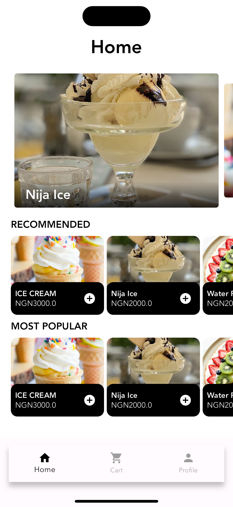

# HNG SHOPPING App

This is a mobile application I developed for the Mobile Track Stage Two Task. 
The main objective is to create an app that integrates with the Timbu API to display product information.
It is mindblowing.

## Objectives

- Create a Timbu account on [Timbu Cloud](https://timbu.cloud)
- Get your API key (Note: it only views once)
- Add product information to your Timbu account under Retail Business
- Retrieve all product information using the API
- Display the products on a screen in a list

## Requirements

- **Implementation of Timbu API**: The app must fetch and display data from the Timbu API.
- **Proper Mobile Architecture**: The app should follow a clean architecture.
- **Product Display**: Display at least 10 products with images from the Timbu API on a screen in a list.
- **Relevant Product Information**: Show relevant information of the products added on Timbu in the list items.
- **UI State Management**: Properly manage UI states and handle errors gracefully.


## Setup Instructions

1. **Clone the repository**

   ```bash
   git clone https://github.com/yourusername/hng_ecommerce_app.git
   cd hng_ecommerce_app
   ```

2. **Install dependencies**

   ```b
   flutter pub get
   ```

3. **Run the app**

   Connect your device or start an emulator, then run:

   ```
   flutter run
   ```


## Set up the Timbu API:

Create an account on Timbu Cloud.
Retrieve your API key and add products to your account under Retail Business.
Update the lib/network/timbu_api.dart file with your API key.


## App Information
Architecture: The app follows a clean  architecture with proper state management using Bloc.

Dependencies: Only necessary third-party packages are used to keep the app lightweight and efficient.

**App Screenshots**


## Links
Appetize.io Showcase: [View the app](https://appetize.io/app/b_oi2wfsnoacl5gtnan7akmmpbem?device=pixel7&osVersion=13.0)

## APK Download

Download the latest version of the app from the link below:

[Download APK](apk.apk)


## Documentation
Timbu API Documentation [VIEW HERE](https://docs.timbu.cloud/api/)

## Contributing

Contributions are welcome! If you'd like to contribute, please follow these steps:

1. Fork the repository
2. Create a new branch: `git checkout -b feature/your-feature-name`
3. Make your changes
4. Commit your changes: `git commit -m 'Add some feature'`
5. Push to the branch: `git push origin feature/your-feature-name`
6. Submit a pull request

Please ensure your code adheres to the existing code style and includes appropriate tests.

## License

This project is licensed under the MIT License - see the [LICENSE](LICENSE) file for details.

---

